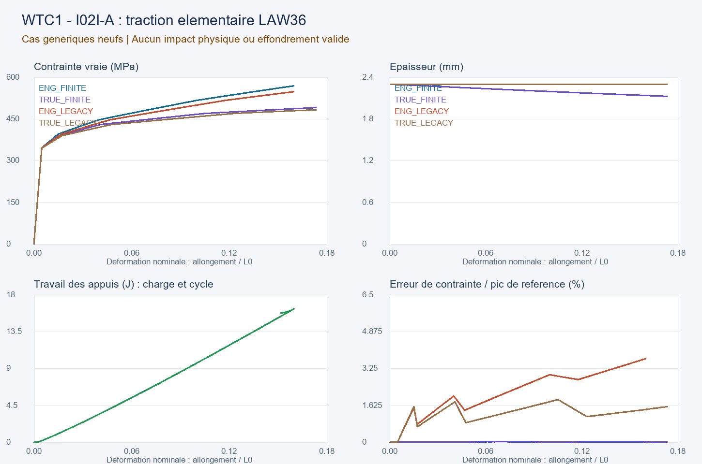

# WTC-simu2026

**Construction progressive d'une simulation exploratoire du WTC 1 : impact d'un Boeing 767, incendies et réponse structurelle, jusqu'à un éventuel effondrement ou son arrêt.**

Le projet teste des mécanismes, des hypothèses explicites et des plages de paramètres. Aucun résultat final n'est présupposé. Il s'agit d'une recherche personnelle reproductible, assistée par Codex, dont les modèles, calculs, essais rejetés et limites sont publiés pour être examinés et améliorés.

*English: an open, incremental WTC 1 research harness. Current results concern limited verification models; they do not establish the cause or reproduce the full historical collapse.*

## Où en est la simulation ?

Instantané du **1er octobre 2026** : **IMPACT-I02I-A terminée**, prochaine étape **IMPACT-I02I-B**. Les 108 entrées du registre conservent la progression et les diagnostics. Les anciennes mentions de V8H ou V11H décrivent des étapes historiques.

| Axe | État à cet instantané |
| --- | --- |
| Harnais de recherche | Configurations, unités, sources, scripts, contrôles, résultats et passations conservés. |
| Impact et matériaux | Sous-modèles de contact, assemblages et déchirure étudiés. Dernière étape : dix tractions homogènes de coque QEPH ; les sept variantes explicites passent leurs 145 critères. |
| Limites de cette étape | Les trois témoins hérités/petites déformations conservent leurs critères échoués. La convention de déformation d'une source NASA reste indéterminée ; deux interprétations sont gardées séparément. |
| Thermique et structure | Branche V11R achevée, V11S prévue. Le contrôle froid V11F est conservé. Températures prescrites et essais thermiques limités ne constituent pas un incendie WTC calculé. |
| Géométrie et visualisation | Modèles Blender et exports de certains états numériques disponibles. Leur portée dépend de celle du sous-modèle mécanique correspondant. |
| Simulation complète | **Non atteinte** : couplage complet avion/bâtiment/feu/propagation et validation historique encore à construire. |



Cette figure concerne des éprouvettes numériques neuves, sans fracture, avion ou façade. Elle n'est pas une simulation de l'effondrement.

Lire le [rapport de la dernière étape](wtc1_simulation_v8/output/impact_i02i_material/rapport_impact_i02i_material.md), sa [vérification finale](wtc1_simulation_v8/output/impact_i02i_material/publication_verification.json) et la [passation technique](harness/handoffs/WTC1_IMPACT_I02I_A_HANDOFF.md).

## Ce qui est publié

- `harness/` : état scientifique, registre des expériences, références, contrôles et passations.
- `wtc1_simulation_v8/scripts/` et `data/` : code des calculs et configurations numériques.
- `wtc1_simulation_v8/output/`, dossiers CalculiX et OpenRadioss : résultats, rapports, bilans et diagnostics, y compris essais rejetés.
- `wtc1_3d_v4/` : scripts de visualisation, paramètres, audits et modèles/rendus dans les archives de résultats.
- `outputs/` : calculs exploratoires antérieurs et audits complémentaires. Leurs affirmations se lisent avec leurs propres limites ; leur présence n'est pas une validation.
- `publication/` : inventaire complet, empreintes SHA-256, règles de publication, licences tierces et liste motivée des fichiers externes non redistribués.

Inventaire : **4,132 fichiers scientifiques dans Git**, **7,095 fichiers en 23 archives**. Ensemble : 18.79 Go originaux ; archives compressées : 6.69 Go.

**Les sorties lourdes sont dans les [archives de la release](https://github.com/WTC-simu2026/WTC-simu2026/releases/tag/snapshot-2026-10-01-impact-i02i-a)**. Elles conservent les chemins relatifs et les octets des résultats originaux. Cela évite de placer les gros fichiers de solveur dans l'historique Git. Aucun résultat n'est écarté parce qu'un critère échoue.

Les [archives complémentaires de diagnostics historiques](https://github.com/WTC-simu2026/WTC-simu2026/releases/tag/snapshot-2026-10-01-impact-i02i-a) ajoutent les préflights, essais interrompus et brouillons numériques conservés sous `tmp/`, ainsi que quatre anciens helpers de sources sous `work/`. **Ces brouillons ne remplacent pas les rapports finaux.** Les 23 archives sont regroupées dans la même release pour la restauration complète.

Les exécutables installés, archives personnelles, PDF sources, pages web tierces et images documentaires sans licence de redistribution établie ne sont pas placés sous la licence du projet. Leurs références, empreintes et chemins attendus restent documentés ; voir [SOURCES.md](SOURCES.md) et [l'inventaire des exclusions](publication/excluded_sources.json).

## Consulter et vérifier sans relancer les solveurs

```powershell
git clone https://github.com/WTC-simu2026/WTC-simu2026.git
cd WTC-simu2026
python tools/verify_public_snapshot.py
```

Ce contrôle vérifie les fichiers présents dans Git, l'état, le registre et les empreintes de l'instantané. Il annonce séparément les fichiers de release qui restent à télécharger. Il vérifie l'intégrité de la publication, pas la physique du WTC.

Pour restaurer et vérifier toutes les sorties brutes, télécharger les ZIP de la release, puis utiliser :

```powershell
python tools/restore_release_assets.py --archives CHEMIN_VERS_LES_ZIP
python tools/verify_public_snapshot.py --full
```

Le restaurateur vérifie chaque archive puis chaque fichier ; il refuse d'écraser un fichier différent. Ces outils utilisent uniquement la bibliothèque standard Python.

## Reproduire ou poursuivre les calculs

Voir [REPRODUCIBILITY.md](REPRODUCIBILITY.md). La base Python utilise NumPy et Pillow ; certains scripts demandent aussi pandas, matplotlib, pypdf ou pdfplumber. OpenRadioss, CalculiX, Blender et ParaView sont des logiciels séparés, à obtenir auprès de leurs projets respectifs.

**La lecture et la vérification des résultats sont portables ; la relance de toutes les itérations ne l'est pas encore.** Des scripts historiques conservent des chemins Windows et des dépendances locales. Les configurations et journaux originaux sont préservés, et cette limite est explicite. Aucun solveur n'est relancé par le contrôle de publication.

## Prochaine étape

IMPACT-I02I-B : créer des états matériels neufs, conserver séparément les deux interprétations de la source NASA, fixer les raideurs cohésives par unité d'aire indépendamment du maillage et du matériau, puis comparer trois maillages locaux avec un témoin sans propagation. Les bilans d'énergie, l'inertie, le pas de temps, la vitesse et les limites du domaine doivent être déclarés avant la campagne. Les valeurs Gf 15/30/60 restent des sensibilités hypothétiques.

La branche thermique garde sa propre progression V11R → V11S. La passation et `harness/state.json` font autorité pour la reprise.

## Discipline de preuve

Chaque rapport distingue observations/transcriptions, résultats de modèles officiels, affirmations des archives, hypothèses du projet, résultats dérivés et informations manquantes. Les données NIST utilisées comme entrées ou références ne deviennent pas des observations indépendantes.

- La localisation en flexion après fracture complète n'est pas validée.
- Une température imposée n'est pas un incendie calculé.
- Des tests numériques réussis ne valident pas à eux seuls l'effondrement réel.
- Une fraction de champs synthétiques n'est pas une probabilité de l'événement historique.
- Blender reste une visualisation tant que son animation n'est pas reliée à des états mécaniques vérifiés.

## Licence et contributions

Les travaux propres au projet sont proposés sous [licence MIT](LICENSE). Les composants tiers et leurs dérivés explicitement identifiés gardent leurs licences : notamment GPL-2.0 pour le modèle graphique B762, CC-BY-4.0 pour le jeu SHPB S355 et CC-BY-NC-4.0 pour le cas officiel TWISBEAM. La licence MIT ne remplace aucune de ces licences. Voir [THIRD_PARTY_NOTICES.md](THIRD_PARTY_NOTICES.md).

Les contributions sont bienvenues : corrections de calcul, contrôles indépendants, sources primaires, portabilité ou visualisation. Indiquer la question testée, les unités, les hypothèses, le coût et le critère qui accepterait ou rejetterait le résultat. Conserver les anciennes itérations et publier les échecs utiles. Voir [CONTRIBUTING.md](CONTRIBUTING.md).
