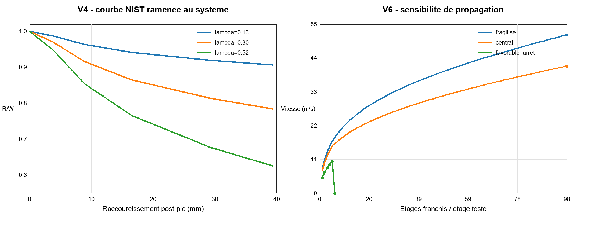

# WTC 1 — enquête technique V4 à V6

Date de calcul : 13 août 2026  
Périmètre : amorce et propagation depuis les étages 94–99  
Nature du travail : modèle réduit de sensibilité, **pas** reconstitution éléments finis de la tour

## Conclusion en une page

Le remplacement du paramètre abstrait `r = R/W` de la V3 par des données de sections et des courbes NIST change le diagnostic de façon utile, mais ne donne pas une réponse unique.

1. La charge verticale NIST au niveau 98 est de **73 144 kip = 325,36 MN**, soit une masse gravitaire équivalente de **33,18 millions de kg**. La perte d’énergie potentielle sur 3,66 m vaut donc **1,191 GJ**. C’est 39 % de moins que les **1,94 GJ** calculés en V2–V3 avec la masse publiée de 54,06 millions de kg. Pour la suite, 33,18 millions de kg est la valeur de base parce qu’elle provient directement du tableau de charges du modèle WTC 1 de NIST.

2. La V4 utilise la courbe post-flambement de la colonne de façade 151, étages 95–96, publiée par NIST. Sur les **39 mm** documentés après le pic, le système acquiert seulement **0,19 à 0,48 m/s**, selon la courbe et la fraction de charge qui entre en post-flambement. Ce résultat suffit à montrer qu’une instabilité peut s’amplifier à partir d’une très petite perturbation ; il ne démontre pas encore qu’un étage complet sera franchi.

3. La V5 transforme les sections/nuances en travail plastique sur un étage. Trois enveloppes donnent **0,142 GJ**, **0,499 GJ** et **2,969 GJ**, soit `U/(Mgh) = 0,119`, `0,419` et `2,493`. Les deux premières favorisent la propagation. La troisième peut arrêter le mouvement, mais elle suppose des colonnes bien alignées, froides, toutes engagées, capables de développer un mécanisme très ductile totalisant `4π` radians de rotation plastique.

4. Dans la V6 discrète, les enveloppes « fragilisée » et « centrale » ne s’arrêtent pas dans les 98 étages du domaine. L’enveloppe favorable franchit les cinq étages supposés endommagés puis s’arrête au premier étage intact testé, le sixième. Ces vitesses sont des sorties du modèle réduit, **pas** une prédiction chronométrique de l’effondrement réel.

La conclusion défendable est donc conditionnelle : **les sections et nuances réelles n’imposent pas, à elles seules, l’inévitabilité de la propagation**. Celle-ci dépend surtout de la longueur non contreventée, de la température, des ruptures de liaisons, de l’excentricité, de la part de colonnes qui travaille effectivement et de leur capacité de rotation. Les hypothèses compatibles avec l’état fortement dégradé décrit par NIST conduisent à la propagation ; une enveloppe froide, alignée et très ductile conduit à l’arrêt.

## 1. Inspection des archives locales

Le dossier `C:\Users\jeuxpc\Desktop\ENQUETES\11 septembre 2001` a été inspecté en lecture seule. Aucun fichier source n’a été modifié. Le sous-dossier vidéo n’a pas été ouvert.

- 203 PDF ont été inventoriés, pour environ 0,39 Go ;
- 13 doublons exacts ont été repérés ;
- 3 fichiers sont vides ou illisibles ;
- les documents techniques les plus utiles sont la série FEMA 403, notamment le chapitre 2 et les annexes A, B et D ;
- les analyses non officielles consultées n’apportent pas de nomenclature complète des 47 colonnes du noyau ni de courbe force–déplacement mesurée pour les étages 94–99.

Le dossier local contient également les rapports FEMA et diverses analyses militantes ou spéculatives. Ces dernières sont traitées comme des **affirmations d’archives**, jamais comme des données d’entrée sans vérification indépendante.

## 2. Faits établis utilisés

| Donnée | Valeur retenue | Statut et source |
|---|---:|---|
| Colonnes de façade | 236, soit 59 par face | FEMA 403 chapitre 2 ; NIST |
| Section extérieure générale | caisson d’environ 14 × 14 pouces | FEMA 403 annexe B ; NIST |
| Types NIST dans le sous-système 91–99 | 120 à 125 | [NCSTAR 1-6C](https://nvlpubs.nist.gov/nistpubs/Legacy/NCSTAR/ncstar1-6c.pdf), tableau 6-1a |
| Aire calculée des types 120–125 | 14,06 à 22,34 in² | calcul géométrique à partir du tableau 6-1a |
| Nuances de façade, étages 92–100 | 46 à 100 ksi ; moyenne pondérée 64,19 ksi | [NCSTAR 1-3A](https://nvlpubs.nist.gov/nistpubs/Legacy/NCSTAR/ncstar1-3a.pdf), tableau 2-3 |
| Noyau | 47 colonnes ; au-dessus du niveau 94, 43 des 46 colonnes ordinaires sont des profils larges à ailes | NCSTAR 1-3A |
| Pièce réelle C-80 | 14WF184, colonne 603, étages 92–95, `Fy` spécifié 36 ksi, mesuré 34,4 ksi | [NCSTAR 1-3D](https://nvlpubs.nist.gov/nistpubs/Legacy/NCSTAR/ncstar1-3d.pdf), p. 54 |
| Pièce réelle HH | 12WF92, colonne 605, étages 98–101, `Fy` spécifié 42 ksi, limite apparente mesurée 54,1 ksi | NCSTAR 1-3D, p. 54 |
| Colonne extérieure 151, 95–96 | type 122, acier 65 ksi ; demande estimée 175 kip | NCSTAR 1-6C, §6.5.3 |
| Capacité calculée de cette colonne | 1 030 kip à température ambiante ; 270 kip à 700 °C | NCSTAR 1-6C, figure 6-14 et texte associé |
| Charge totale au niveau 98 | 73 144 kip avant impact ; 73 098 kip à 100 min | [NCSTAR 1-6D](https://nvlpubs.nist.gov/nistpubs/Legacy/NCSTAR/ncstar1-6d.pdf), tableau 4-10 |
| Redistribution à 100 min | noyau : 34 029 → 28 478 kip ; face sud : 11 025 → 9 638 kip | NCSTAR 1-6D, tableau 4-10 |
| Couverture des examens thermiques | 21 panneaux ≈ 3 % des panneaux des étages incendiés ; moins de 1 % des colonnes du noyau | [NCSTAR 1-3C](https://nvlpubs.nist.gov/nistpubs/Legacy/NCSTAR/ncstar1-3c.pdf), annexe E |

Important : les 978 pièces du tableau 2-3 de NCSTAR 1-3A traversent plusieurs niveaux. Elles servent ici à établir une distribution de nuances ; elles ne sont pas additionnées comme 978 colonnes simultanées.

## 3. Hypothèses du modèle, séparées des faits

| Hypothèse | Plage ou choix | Incidence |
|---|---|---|
| Hauteur d’étage | 3,66 m | cohérente avec les 12 ft nominaux employés dans V1–V3 |
| Part de charge qui entre en post-flambement `λ` | 0,13 ; 0,30 ; 0,52 | 0,13 correspond approximativement à la part de la face sud à 100 min ; 0,52 à face sud + noyau ; 0,30 est intermédiaire |
| Courbes V4 | digitisation approximative de la figure 6-14 | NIST ne publie pas les points numériques ; incertitude de lecture du tracé |
| Module plastique de façade | 72,1 à 99,6 in³ | approximation faible axe à partir des plaques du tableau 6-1a |
| Module plastique du noyau | 60 à 140 in³ | enveloppe faible axe fondée sur les deux profils récupérés, pas nomenclature complète |
| Facteur de résistance thermique | 0,55 ; 0,75 ; 1,00 | encadre acier fortement chauffé, modérément chauffé et froid |
| Somme des rotations plastiques | `2π` ou `4π` rad | mécanisme à trois articulations, puis mécanisme très ductile supérieur |
| Fraction effectivement engagée | 0,35 ; 0,65 ; 1,00 | représente désalignement, rupture de liaison, fracture et contournement des efforts |
| Premiers étages endommagés en V6 | 5 | sensibilité cohérente avec une zone 94–99, sans prétendre fixer une frontière nette |
| Résistance sous la zone 94–99 | proportionnelle à la masse supportée | extrapolation nécessaire faute de nomenclature complète des étages inférieurs |
| Masse capturée à chaque étage | 70 %, 80 % ou 100 % | collision parfaitement inélastique de cette fraction ; débris éjectés non suivis |

Le modèle ne comprend pas explicitement le travail des planchers, des connexions de fermes, des épissures, du béton, de la fragmentation ni de l’éjection latérale. Leur omission n’est pas uniformément conservatrice : certains absorbent de l’énergie, tandis que des ruptures précoces diminuent l’engagement des colonnes.

## 4. V4 — amorce avec courbe force–déplacement NIST

La V4 remplace la résistance résiduelle arbitraire de la V3 par :

`R(x)/W = (1 − λ) + λ q(x)`

où `q(x) = P(x)/Ppic` provient de la figure 6-14 de NCSTAR 1-6C. Le calcul part d’une perturbation de 1 mm, vitesse nulle, et s’arrête à 39,37 mm, limite post-pic lisible du graphe.

| Courbe NIST approximée | `λ` | `R/W` final | vitesse à 39,37 mm | temps depuis 1 mm |
|---|---:|---:|---:|---:|
| 1 étage, chute rapide à température ambiante | 0,13 | 0,895 | 0,238 m/s | 0,563 s |
| idem | 0,30 | 0,757 | 0,361 m/s | 0,370 s |
| idem | 0,52 | 0,579 | 0,476 m/s | 0,281 s |
| 2 étages, intermédiaire | 0,13 | 0,906 | 0,211 m/s | 0,746 s |
| idem | 0,30 | 0,784 | 0,321 m/s | 0,491 s |
| idem | 0,52 | 0,626 | 0,423 m/s | 0,373 s |
| 3 étages, enveloppe ductile à 400 °C | 0,13 | 0,916 | 0,192 m/s | 0,831 s |
| idem | 0,30 | 0,805 | 0,292 m/s | 0,547 s |
| idem | 0,52 | 0,662 | 0,384 m/s | 0,415 s |

La V4 confirme l’idée qualitative de la V3 : après le pic, une branche descendante produit une accélération sans qu’une chute libre préalable d’un étage soit imposée. Mais le travail déficitaire accumulé n’est que **0,61 à 3,76 MJ**, très loin des 1,191 GJ libérés sur un étage complet. L’extrapolation sur 3,66 m ne peut donc pas provenir de la seule figure 6-14.

Autre résultat important : la colonne 151 isolée conserve, même à 700 °C, 270 kip de capacité pour 175 kip de demande. Le simple slogan « l’acier chauffé cède » est insuffisant. L’instabilité globale requiert les effets combinés décrits par NIST : allongement de la longueur non contreventée, déformation des murs, redistribution, dommages et chargement différentiel.

## 5. V5 — énergie de mécanisme issue des sections

Pour franchir un étage, la V5 utilise :

`U = Σ (Fy × Zp) × Cθ × ηT × ηe`

avec `Fy × Zp = Mp`, moment plastique ; `Cθ` est la somme des rotations des articulations ; `ηT` la réduction thermique ; `ηe` la fraction de colonnes effectivement engagée.

| Enveloppe | Sections/nuances | `ηT` | `Cθ` | `ηe` | `U` | `U/(Mgh)` NIST | `U/(Mgh)` avec 54,06 Mt |
|---|---|---:|---:|---:|---:|---:|---:|
| Fragilisée | façade type 120, 55 ksi ; noyau bas | 0,55 | `2π` | 0,35 | 0,142 GJ | 0,119 | 0,073 |
| Centrale | moyenne types 120–125, 64,19 ksi ; noyau mixte | 0,75 | `2π` | 0,65 | 0,499 GJ | 0,419 | 0,257 |
| Favorable à l’arrêt | type 125, 75 ksi ; noyau haut | 1,00 | `4π` | 1,00 | 2,969 GJ | 2,493 | 1,530 |

L’enveloppe basse retrouve presque exactement le ratio 0,12 utilisé comme référence en V2, mais cette proximité est fortuite : ici le résultat provient d’un mécanisme de sections, d’une réduction thermique et d’un engagement explicite.

Le seuil d’arrêt énergétique est `U/(Mgh) ≥ 1` si l’énergie cinétique entrante est nulle. Les scénarios fragilisé et central sont sous le seuil. Le scénario favorable est au-dessus, même avec la masse antérieure de 54,06 Mt. Cette dernière enveloppe est toutefois volontairement difficile à réaliser dans une zone déjà endommagée : aucun désalignement, aucune rupture prématurée et quatre demi-tours cumulés de rotation plastique pour l’ensemble des colonnes.

## 6. V6 — propagation discrète et accrétion

À chaque étage, la V6 :

1. ajoute `Mgh` à l’énergie disponible ;
2. retranche l’énergie V5 de l’étage ;
3. arrête le calcul si le solde est négatif ;
4. applique une collision parfaitement inélastique avec une fraction de la masse de l’étage ;
5. augmente la résistance des étages inférieurs proportionnellement à la masse supportée.

| Scénario | Réduction sur les 5 étages endommagés | masse d’étage capturée | résultat |
|---|---:|---:|---|
| Fragilisé | 0,50 | 70 % | aucun arrêt dans les 98 étages ; vitesse finale modèle 51,5 m/s |
| Central | 0,50 | 80 % | aucun arrêt dans les 98 étages ; vitesse finale modèle 41,3 m/s |
| Favorable à l’arrêt | 0,25 | 100 % | cinq étages franchis ; arrêt au sixième étage testé |

Les valeurs de vitesse ne doivent pas être comparées directement aux vidéos : le modèle ne suit ni la géométrie réelle du front de ruine, ni les débris éjectés, ni la persistance temporaire du noyau, ni la durée des collisions. La sortie robuste est seulement l’existence ou non d’un arrêt dans chaque enveloppe.

## 7. Comparaison honnête avec NIST

### Points compatibles

- La V4 confirme qu’une branche post-flambement descendante peut amplifier une perturbation sans imposer artificiellement une chute libre d’un étage.
- La redistribution de charge choisie pour `λ` est cohérente avec le tableau 4-10 de NCSTAR 1-6D : le noyau se décharge fortement tandis que les faces est et ouest reprennent de la charge.
- Les enveloppes fragilisée et centrale rendent la propagation énergétiquement possible, conformément à la conclusion qualitative de NIST.
- Le modèle ne reproduit pas une théorie de « pile de crêpes » où seuls les planchers lâchent : la résistance dominante examinée est celle des colonnes, avec interaction implicite des pertes de contreventement.

### Ce que NIST n’établit pas numériquement dans les rapports publiés

La [FAQ officielle NIST](https://www.nist.gov/world-trade-center-investigation/study-faqs/wtc-towers-investigation) dit que la propagation était « readily explained » après l’amorce. Elle ne publie toutefois pas, pour WTC 1, une simulation globale post-amorce avec une courbe force–déplacement de tous les étages jusqu’au sol. La figure 6-14 s’arrête à environ 2 pouces de déplacement total. Le passage de ces quelques centimètres à 3,66 m repose donc sur un mécanisme énergétique supplémentaire.

Notre enveloppe favorable montre qu’un arrêt est mathématiquement possible si la structure sous-jacente reste froide, alignée et très ductile. Ce n’est pas une contradiction avec l’effondrement observé ; c’est la démonstration que l’affirmation d’inévitabilité dépend d’hypothèses de dommage, de désengagement et de ductilité que les rapports publics ne réduisent pas à une valeur unique vérifiable.

## 8. Contradictions et incertitudes à signaler

1. **Masse supérieure.** La valeur de 54,06 Mt utilisée auparavant conduit à 1,94 GJ par étage ; le tableau NIST donne 33,18 Mt équivalentes et 1,191 GJ. L’écart de 63 % sur la masse est matériel. La base NIST est retenue, mais les deux ratios sont publiés.

2. **Colonne chaude isolée.** NIST trouve 270 kip de capacité à 700 °C pour 175 kip de demande sur la colonne 151. Une température élevée n’entraîne donc pas automatiquement la ruine de ce membre. L’explication doit rester systémique.

3. **Températures médico-légales.** La majorité des régions de peinture examinées ne montre pas d’exposition supérieure à 250 °C, mais l’échantillon ne représente qu’environ 3 % des panneaux et moins de 1 % du noyau des étages concernés. Ce résultat ne valide ni ne réfute à lui seul les champs thermiques NIST.

4. **Nomenclature incomplète.** Deux profils réels du noyau sont identifiés dans la zone, pas les 47. Les modules plastiques du noyau restent donc une enveloppe, et non un inventaire colonne par colonne.

5. **Épissures et ruptures.** FEMA décrit des assemblages boulonnés dont la capacité en moment peut être bien plus faible que celle de la section. NIST ne les modélise pas comme mécanisme précurseur principal dans le sous-système de façade. Leur comportement pendant la propagation reste une incertitude majeure.

6. **Rotation plastique.** `2π` et surtout `4π` supposent que les charnières se développent avant fracture, déchirure de soudure, flambement local ou perte de contact. C’est le paramètre dominant de V5 avec la fraction d’engagement.

## 9. Affirmations des archives locales, gardées séparées

- *Septembre 2001 aux États-Unis : analyse physique des événements* affirme notamment que « le haut de l’immeuble ne peut avoir écrasé le bas » et que la force dynamique serait inférieure à la force statique. Cette affirmation n’est pas compatible avec un bilan après perte de stabilité : V4 montre un déficit de résistance et une acquisition d’énergie cinétique dès les premiers millimètres ; V5 montre ensuite que l’arrêt dépend de `U/(Mgh)`, pas d’un principe général interdisant l’écrasement.
- *Why Indeed Did the WTC Buildings Completely Collapse?* avance une hypothèse thermitique, mais ne fournit pas de loi force–déplacement ni de nomenclature 94–99 permettant d’améliorer V4–V6. Cette hypothèse n’est donc ni entrée dans le calcul, ni évaluée par celui-ci.
- *Pourquoi trois gratte-ciels se sont effondrés le 11.9.2001* rapproche les effondrements d’une démolition et affirme de façon générale que les gratte-ciels d’acier ne s’effondrent pas par le feu. Le document ne quantifie pas le travail plastique des sections réelles de WTC 1 ; sa conclusion ne remplace pas le calcul.

Ces documents peuvent contenir des questions légitimes, mais leurs conclusions causales ne deviennent pas des faits par leur seule présence dans l’archive.

## 10. Ce qu’une V7 devrait ajouter

- reconstituer, colonne par colonne, les types et orientations du noyau à partir de la base structurelle NIST si elle est accessible ;
- obtenir les valeurs numériques originales de la figure 6-14 plutôt qu’une digitisation ;
- modéliser séparément épissures, soudures, sièges de fermes et pertes de contreventement ;
- introduire excentricité et basculement du bloc supérieur en 3D ;
- calibrer le déplacement initial sur plusieurs vidéos synchronisées, seulement après la phase documentaire et en conservant une incertitude de perspective ;
- comparer les temps de V7 aux observations sans utiliser la durée sismique comme durée totale de ruine.

## Sources principales

- NIST NCSTAR 1-3A, *Contemporaneous Structural Steel Specifications*.
- NIST NCSTAR 1-3C, *Damage and Failure Modes of Structural Steel Components*.
- NIST NCSTAR 1-3D, *Mechanical and Metallurgical Analysis of Structural Steel*.
- NIST NCSTAR 1-6C, *Component, Connection, and Subsystem Structural Analysis*.
- NIST NCSTAR 1-6D, *Global Structural Analysis of the Response of the WTC Towers to Impact Damage and Fire*.
- FEMA 403, chapitre 2 et annexe B, copies présentes dans les archives locales.

Les calculs détaillés, le CSV et le graphique sont produits par `wtc1_v4_v6_model.py` dans le même dossier que ce rapport.
