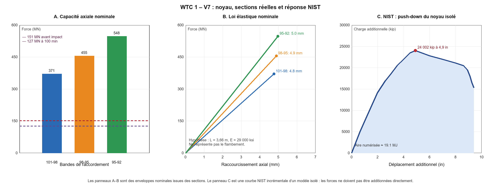

# WTC 1 — V7 : capacité du noyau issue des sections réelles

## Résultat principal

Les 47 nomenclatures du Drawing Book 3 remplacent désormais l’enveloppe abstraite utilisée dans les versions précédentes. La somme des charges axiales de plastification brute vaut **370.9 MN**, **455.1 MN** et **547.6 MN** pour les trois bandes 101–98, 98–95 et 95–92. Au niveau 98, NIST donne pour le noyau **151,4 MN avant impact** et **126,7 MN à 100 min**. La charge représente donc environ 23 à 41 % de la plastification axiale brute suivant la bande et l’instant.

Ce résultat ne doit pas être lu comme une marge de sécurité réelle : une colonne chauffée, endommagée et fléchie peut perdre sa stabilité bien avant `A × Fy`. Il permet cependant de mesurer la réduction globale que le scénario doit expliquer, au lieu de la cacher dans un coefficient de résistance libre.

Le point le plus important est interne aux calculs officiels : le push-down NIST du **noyau isolé**, après la condition thermique Case B, atteint encore **24 002 kip (106,7 MN) de charge additionnelle à 4,9 in (124 mm)**, soit 61 % de la force des colonnes avant push-down. Dans ce sous-modèle, le noyau seul garde donc une réserve substantielle. L’amorce globale décrite par NIST dépend nécessairement du couplage noyau–planchers–façades–hat truss et des instabilités géométriques ; elle ne peut pas être reproduite honnêtement par un bloc supérieur posé sur une résistance verticale unique.

## Capacités calculées

| Bande | Niveaux représentés | Aire brute (in²) | Fy moyen pondéré (ksi) | A·Fy (kip) | A·Fy (MN) | A·Fy / charge noyau avant impact |
|---|---|---:|---:|---:|---:|---:|
| 101-98 | niveaux 99-100 | 2208.8 | 37.7 | 83 376 | 370.9 | 2.45 |
| 98-95 | niveaux 96-97 | 2638.4 | 38.8 | 102 305 | 455.1 | 3.01 |
| 95-92 | niveaux 93-94 | 3122.4 | 39.4 | 123 095 | 547.6 | 3.62 |

## Faits établis utilisés

- Drawing Book 3 : 47 colonnes identifiées 501–508, 601–608, 701–708, 801–807, 901–908 et 1001–1008 ; sections et nuances transcrites pour les bandes 101–98, 98–95 et 95–92.
- La feuille 3-AB2-9 montre que les types caissons 313–356 et 368–382 utilisent deux plaques n°1 et deux plaques n°2 ; les aires des types 377, 378 et 379 sont donc calculables sans supposer leur multiplicité.
- NCSTAR 1-6D, tableau 4-10 : charges du noyau au niveau 98 de 34 029 kip avant impact, 34 429 kip après impact et 28 478 kip à 100 min pour le modèle global Case B.
- NCSTAR 1-6D, figure 3-130 et texte associé : maximum de push-down additionnel de 24 002 kip à 4,9 in ; calcul arrêté à 9,4 in ; pic égal à 61 % de la force des colonnes avant push-down dans le modèle de noyau isolé.

## Hypothèses de V7

- Pour les profilés WF, l’aire brute est déduite du poids nominal avec une masse volumique de 490 lb/ft³. C’est une très bonne reconstruction de l’aire, mais pas une propriété certifiée au centième.
- La pré-pente élastique emploie `E = 29 000 ksi` et une longueur axiale d’un étage de 144 in. Cette longueur ne constitue pas un facteur de flambement effectif.
- `A × Fy` est une borne de plastification axiale brute, pas une résistance de calcul et encore moins une énergie absorbable sur un étage.
- Les points intermédiaires de la figure 3-130 sont numérisés visuellement. Le pic et les déplacements 4,9/9,4 in proviennent directement du texte NIST.

## Archives locales : statut séparé

Le seul élément d’archive locale utilisé comme donnée de structure dans V7 est le Drawing Book 3. Aucune affirmation provenant de vidéos, d’articles militants ou de commentaires d’archives n’entre dans les calculs. Le relevé des 47 feuilles reste marqué **transcription manuelle à relire indépendamment**.

## Contradictions apparentes et incertitudes

- **Pas une contradiction formelle :** la réserve du noyau isolé et l’effondrement du modèle global peuvent coexister si les planchers, façades et transferts de charge rendent l’ensemble instable. Mais ce couplage devient le mécanisme à démontrer quantitativement.
- **Limite forte :** la courbe officielle ne couvre que 239 mm, environ 6,5 % d’un étage. Son aire numérisée vaut environ **19.1 MJ** ; elle ne donne pas l’énergie de destruction du noyau sur 3,66 m.
- **Données manquantes :** températures et défauts géométriques colonne par colonne, moments, dommages de l’impact, conditions d’appui, connexions et participation des planchers. Sans eux, une simulation 3D visuellement exacte ne serait pas encore mécaniquement prédictive.

## Suite V8 proposée

1. Affecter aux 47 identifiants les charges et états NIST à 100 min, notamment les colonnes 904, 1004, 1005 et 1006 signalées flambées dans le sous-modèle Case B.
2. Ajouter la façade et les transferts par planchers/hat truss afin de tester si le système global perd réellement sa réserve alors que le noyau isolé en conserve.
3. Utiliser Blender pour l’animation et la vérification géométrique, mais confier la rupture à un solveur structurel explicite ; Blender seul ne remplace pas cette étape.

