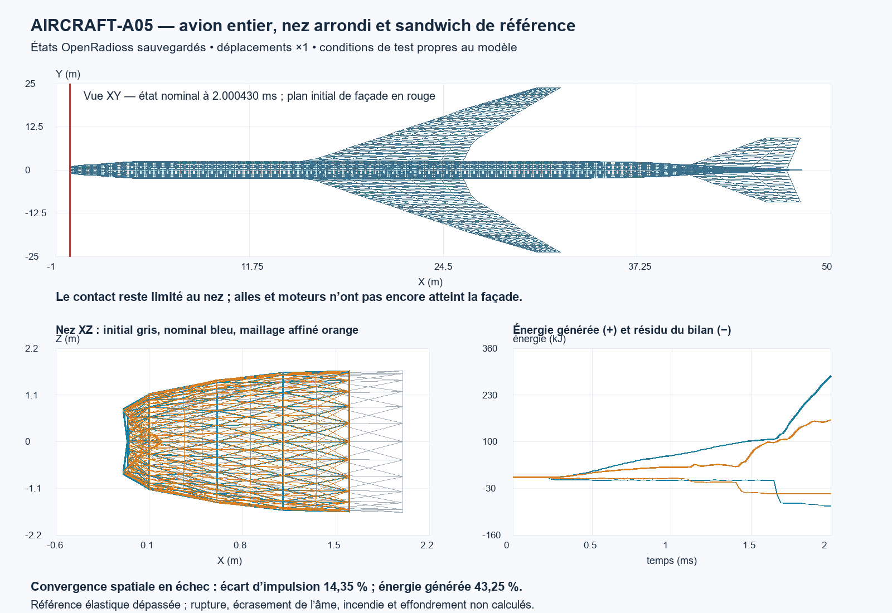

# AIRCRAFT-A05 — nez arrondi et sandwich composite dans l’avion entier

Le substitut plat métallique du nez a été remplacé par une surface arrondie, puis par un sandwich élastique de référence dans des départs intacts de l’avion entier. **Les huit cas avec contact atteignent 2 ms ; le contrôle libre atteint 0,6 ms.** Le blocage géométrique d’A04 à environ 1,63 ms n’apparaît pas dans ces essais. Cela constitue un progrès de modélisation, pas une reconstruction qualifiée de l’impact.

Le contrôle libre et les vérifications de masse, graphe, appuis, états finis et quantité de mouvement passent. La réduction du pas passe, mais **l’affinement du nez donne 14,35 % d’écart d’impulsion et 43,25 % d’énergie générée : les deux critères spatiaux échouent**. Les résistances de référence des faces sont dépassées dans tous les contacts composites. Tous les contacts échouent le bilan énergétique local. Aucun matériau n’est renforcé pour cacher ces résultats ; aucun dégât NIST ne sert de cible.

## 1. Faits directement observés ou transcrits

La fiche [Boeing ARFF 767, page PDF 6](https://www.boeing.com/content/dam/boeing/v2/airports/arff/arff767.pdf) place le radôme parmi les composants composites. Sa date 2022 et l’absence de stratification interdisent de l’attribuer précisément à AA11 en 2001. La fiche [HexPly 913, page 4](https://www.hexcel.com/wp-content/uploads/2026/01/HexPly_913_us_DataSheet.pdf) donne pour 7781GL/R913 37 %, 300 AW une densité de 1,83 g/cm³, E en traction 22 GPa, résistance en traction 450 MPa et compression 460 MPa ; E en compression est 28 GPa. Ce sont des valeurs typiques à température ambiante, pas des mesures de radôme 767. Le cisaillement court de 65 MPa n’est pas une résistance de cisaillement dans le plan.

La fiche [HRH-10, page 4, code HRH-10-3.2-48](https://www.hexcel.com/wp-content/uploads/2025/12/HexWeb_HRH10_DataSheet_eu1.pdf) donne une densité nominale 48 kg/m³, E transversal 138 MPa, G longitudinal 41 MPa et transversal 24 MPa, résistances de cisaillement 1,21/0,69 MPa et compression nue 2,07 MPa. Elle ne prouve pas que cette âme équipe le radôme du 767. Les deux nouveaux PDF sont acquis, hashés et conservés en lecture seule. Ils sont exclus de la redistribution de nos propres calculs ; URLs et script de réacquisition sont conservés.

Les neuf Starter retenus ont zéro erreur et avertissement ; les neuf Engines et neuf observateurs terminent normalement. 12 Starter au total incluent trois tentatives de format rejetées avant Engine. Aucun ancien solveur n’a été relancé. Le calcul principal totalise 402.91 s, chaque cas étant plafonné à 300 s. Les états natifs et leurs connectivités sont vérifiés par identifiants ; les cellules virtuelles RBE3 d’identifiant élément 0 sont exclues de la collecte des tenseurs physiques.

## 2. Résultats d’un modèle officiel

Aucun résultat officiel nouveau n’est utilisé comme objectif. La façade de 59 colonnes × 3 étages, 31 792 nœuds et 31 986 quadrilatères conserve les entrées nominales NIST héritées et leurs limites représentatives. Cette dépendance aux dimensions nominales demeure déclarée. Aucun motif de destruction NIST, aucune durée d’effondrement ni résultat historique ne règle le composite, le contact ou la géométrie. Les résultats ci-dessous sont ceux de notre modèle exploratoire OpenRadioss.

## 3. Affirmations des archives locales

Aucune archive n’est rescannée et aucune vidéo n’est analysée. Les 2878 fichiers antérieurs épinglés sont préservés. Les échecs A02 de CG, les extrapolations A03, les arrêts et premières interprétations A04 restent visibles. L’annotation A04 du triangle 4050 utilisait des indices de tableau commençant à zéro ; ses vrais identifiants natifs sont **2041, 18, 19**. Le deck A04 n’est pas modifié. V11F froid, V11R et V11S différée, I02I-M différée restent conservés.

## 4. Hypothèses, unités et historique

La zone modifiée couvre le nez jusqu’à X=2 m. Sa section ellipsoïdale propre au modèle suit r(x)/r(2m)=√[1−(1−x/2m)²]. La première couronne passe de X=0 à 0,25 m ; la pointe reste à X=0 et la jonction à 2 m utilise les nœuds communs. Dimensions, jonction et épaisseurs sont des hypothèses, pas une reconstruction de fabrication. Hors de cette zone, les coordonnées restent identiques à 10⁻⁷ mm près ; la recomposition trigonométrique de la couronne de jonction laisse seulement un arrondi maximal de 4,15×10⁻⁸ mm. Les cartes de façade, masses additionnelles, appuis et vitesse ne changent pas.

ROUND_METAL conserve les poutres et les lois métalliques A04 en ne changeant que la forme du nez et les orientations géométriques nécessaires. Sa masse varie naturellement de +48,768 kg. Les cas composites retirent 192 cadres/longerons fictifs situés dans les deux premiers mètres et remplacent 216 triangles de peau/cap par le sandwich. La variante fine utilise 840 triangles de nez, 3540 nœuds avion et 35332 nœuds au total ; elle subdivise exactement les mêmes facettes planes, sans changer leur surface ni la masse. La frontière de 24 arêtes est conforme et partagée avec le fuselage, sans nœud suspendu. Cette jonction est parfaitement liée ; sa rupture n’est pas calculée.

| Couche de référence | Épaisseur nominale (mm) | ρ (kg/m³) | E1/E2 (MPa) | ν12 | G12/G23/G31 (MPa) |
|---|---:|---:|---:|---:|---:|
| Face verre/époxy | 0,5 chacune | 1830 | 22000/22000 | 0,25 | 4000/4000/4000 |
| Âme aramide nid d’abeille | 8 | 48 | 1/1 | 0,1 | 0,5/24/41 |

Seuls ρ et E1 de la face, ρ et les modules transversaux de l’âme sont repris des fiches. E2, ν, les G de face et E1/E2/G12 de l’âme sont des approximations annoncées. E33 vaut 10000/138 MPa dans les cartes mais n’est pas une compression normale résolue par ces coques en contrainte plane. La rigidité de compression/écrasement réel du nid d’abeille et le délaminage restent absents.

Le sandwich emploie [TYPE51](https://help.altair.com/hwsolvers/rad/topics/solvers/rad/prop_type51_starter_r.htm) avec trois [TYPE19](https://help.altair.com/hwsolvers/rad/topics/solvers/rad/prop_type19_ply_starter_r.htm) de trois points Gauss chacun. Les listings natifs confirment trois points par couche, donc neuf dans l’épaisseur. Axe de référence : X global projeté dans le plan, maintenu en co-rotation. Les sous-triangles coplanaires conservent cette direction initiale. [LAW25 Iform=0](https://help.altair.com/hwsolvers/rad/topics/solvers/rad/tsai_wu_formulation_starter_r.htm) est maintenue élastique avec limite numérique 10¹² MPa et déformations numériques de défaillance 10³⁰. Ces nombres ne représentent pas une résistance réelle. Les valeurs physiques de référence 450/460 MPa sont des diagnostics séparés. Ni rupture, ni érosion, ni rate law, ni effet thermique ne sont activés. Les matériaux métalliques restent A04 élastoplastiques parfaits, E=73,1/71,7/200 GPa, a=324/503/427,656 MPa ; aucune variante H=0,02E n’est sélectionnée.

Pour le sandwich nominal, masse surfacique **2.214 kg/m²**, surface 18.546848432 m², masse de radôme 41.062722 kg. Matrices de référence : A11=A22=23474.747475 N/mm, A12=5867.474747, A66=4004.000000 ; B=0 par symétrie ; D11=D22=424398.653199 N·mm, D12=106093.198653, D66=72354.666667. L’intégrale analytique de Q, zQ et z²Q concorde avec la quadrature à 1.37e-16 près. Ce contrôle vérifie l’intégration de référence, pas une identification expérimentale de rigidité ni à lui seul la flexion native du nez.

L’avion composite nominal pèse 121962.860670 kg, soit −196,325 kg par rapport à A04. Faces 0,25/1 mm : 121945,890303/121996,801402 kg. Aucune réserve de masse ne compense cette modification ; les 53,187 t de vide non résolu restent sans raideur cachée. Les moteurs restent deux masses de 4500 kg et leurs attaches, sans surfaces de contact. Carburant et charge hérités : 30/10 t. La façade conserve 69310,977272 kg.

Conditions propres au test : v0=(-200,5,2) m/s, attitude nulle, distance initiale pointe-plan de façade 50 mm, sans trajectoire imposée après t=0. Pas de gravité, précharge, noyau, planchers ou coins. Appuis haut/bas : 944 nœuds fixes. Unités natives g/mm/ms/MPa/N/N·mm ; conversions vers SI : g×10⁻³, mm×10⁻³, ms×10⁻³, N·mm×10⁻³ J, N·ms×10⁻³ N·s. mm/ms=m/s ; déformations sans dimension. Seed1102030, aucun tirage.

Contact externe TYPE7 : gap constant 5 mm ; variante gap selon épaisseurs avec Igap=1 et Gapmin=1 mm. Autocontact limité au radôme seul : gap égal à 8,5/9/10 mm selon épaisseur. Friction nulle, viscosité normale 10⁻²⁰, pas de correction initiale imposée ni mass scaling. Aucun contact global du reste de l’avion ou entre arêtes n’est qualifié.

## 5. Résultats dérivés, réactions et bilans

| Cas | Fin observée (ms) | Jx contact (N·s) | PW (kJ) | Énergie générée (kJ) | Résidu (kJ) | Diagnostic face max |
|---|---:|---:|---:|---:|---:|---:|
| ROUND_METAL | 2.0005210 | -9787.799 | 616.961 | 1123.152 | -208.848 | 0.000 |
| COMP_FREE | 0.6004502 | 0.000 | 0.000 | 0.000 | 0.000 | 0.000 |
| COMP_NOSC | 2.0004280 | -2619.302 | 4.244 | 283.168 | -78.832 | 3.536 |
| COMP_SELF | 2.0004277 | -2619.302 | 4.244 | 283.168 | -78.642 | 3.536 |
| COMP_HALF_DT | 2.0003431 | -2608.507 | 4.248 | 283.582 | -77.708 | 3.540 |
| COMP_TRUE_GAP | 2.0005207 | -2538.737 | 4.161 | 302.749 | -56.701 | 4.017 |
| COMP_FACE_THIN | 2.0000353 | -1372.769 | 0.646 | 146.859 | -44.821 | 3.383 |
| COMP_FACE_THICK | 2.0001943 | -4921.416 | 21.694 | 542.947 | -142.663 | 3.462 |
| COMP_FINE | 2.0005207 | -2248.281 | 0.210 | 160.712 | -44.598 | 4.520 |

Le premier contact nominal est enregistré à 0.2403271 ms ; gap selon épaisseurs à 0,2204836 ms. Cadence d’histoire 0,02 ms et d’animation 0,2 ms : ces valeurs ne sont pas des instants exacts de premier contact ou de résistance atteinte. La face nominale dépasse sa référence au premier état de 0.600450 ms ; diagnostic maximal 3.536. Celui-ci utilise les valeurs propres du tenseur de contrainte dans le plan, divisées par 450 MPa en traction et 460 MPa en compression, sous l’hypothèse propre de résistances normales identiques dans les directions du tissu. Ce n’est ni un indice Tsai-Wu identifié, ni une probabilité, ni une fracture calculée. Contraintes natives aux points extrêmes des plis ; déformations natives extrapolées suivant [ANIM/SHELL/TENS](https://help.altair.com/hwsolvers/rad/topics/solvers/rad/anim_shell_tens_engine_r.htm). Les tenseurs signés restent dans composite_signed_tensors.npz ; leur base est élémentaire, pas directement celle de l’orthotropie. Aucun seuil de cisaillement/crush de l’âme n’est déclaré validé par ces sorties.

ROUND_METAL atteint εp coque0,195964 et εp maximale des 696 poutres suivies0,09521 ; le diagnostic de coque≤0,1 échoue. Dans COMP_SELF, εp max coque0,011739 et travail plastique global 4.243596 kJ : ce travail provient des métaux. Le radôme élastique garde εp=0, même au-delà de sa résistance de référence ; cela ne signifie pas qu’il resterait intact. Les 504 poutres suivies dans les cas composites restent une sélection max(Xextrémités)≤8 m, avec ordre natif F1,F2,F3,M1,M2,M3,IE,SX,EPSP ; SX ne qualifie pas les fibres de flexion.

Réduire le facteur de pas 0,8→0,4 à l’instant commun 2.00034308 ms donne 0.39547 % d’écart vectoriel d’impulsion et 0.15931 % d’énergie générée ; seuils5/10 % passent. Affiner seulement le maillage du nez à l’instant commun 2.00042772 ms donne 14.34646/43.25002 % ; seuils10/10 % échouent. Deux maillages ne permettent pas d’extrapolation convergée ni de choisir celui qui ressemble à un dommage observé. Leur masse diffère de 1.46e-11 kg et leur surface de 2.84e-14 m², donc l’écart n’est pas dû à un réajustement global de masse ou de géométrie.

L’autocontact reste inactif : toutes ses colonnes d’impulsion sont nulles, les déplacements sauvés avec/sans autocontact sont bit à bit identiques. Cette fenêtre ne valide pas son fonctionnement après pliage actif. Les différences de quelques centaines de joules à la fin avec/sans autocontact proviennent de précision CSV/relecture float32, inférieures à l’allocation déclarée1000 J, pas d’une dissipation physique d’autocontact.

Le contact externe brut est à nouveau compatible avec une **impulsion cumulée N·ms**, J=0,001(raw−raw0), pas avec une force à intégrer une deuxième fois. Les bilans Pfaçade−Pfaçade0=J+Jappui et Pglobal−Pglobal0=Jappui passent la tolérance10 N·s+2 %|J|. Les appuis fixes ne travaillent pas. Leurs petites colonnes sont conservées sous les deux interprétations impulsion cumulative/force intégrée ; leurs unités ne sont pas indépendamment distinguées face à l’arrondi du mouvement global. Pavion=Pglobal−Pfaçade inclut les masses additionnelles.

Énergie comptée = Ktranslation+Krotation+Uinterne+hourglass+ressorts+contactélastique+friction+dissipationcontact. Résidu = ΔEcomptée−Wextérieur. **PW est inclus dans Uinterne**, vérifié sur toutes les histoires et jamais ajouté deux fois. CONTACT ENERGY n’est pas ajoutée à ses composantes. L’énergie générée est rotation+interne+hourglass+ressorts+contactélastique. Aucune énergie perdue n’est réinjectée. K0 nominal=2.441026000 GJ, résidu terminal=-78.642 kJ, soit 27.77 % des 283.168 kJ générés. Tous les contacts passent le critère global0,5 %K0 mais échouent le critère local5 %gen+1000 J après1kJ généré. Un petit résidu relatif au vol entier ne clôt pas le bilan local du nez. Les comparaisons A04 se fondent exclusivement sur ses NPZ sauvegardés, sans ancien Engine.

## 6. Contradictions, informations manquantes et critères échoués

- **ROUND_METAL** : energy_local_within_declared_limit, plastic_strain_below_diagnostic_limit.
- **COMP_FREE** : aucun échec dans les critères déclarés.
- **COMP_NOSC** : energy_local_within_declared_limit, radome_elastic_reference_stress_below_tension_compression.
- **COMP_SELF** : energy_local_within_declared_limit, radome_elastic_reference_stress_below_tension_compression.
- **COMP_HALF_DT** : energy_local_within_declared_limit, radome_elastic_reference_stress_below_tension_compression.
- **COMP_TRUE_GAP** : energy_local_within_declared_limit, radome_elastic_reference_stress_below_tension_compression.
- **COMP_FACE_THIN** : energy_local_within_declared_limit, radome_elastic_reference_stress_below_tension_compression.
- **COMP_FACE_THICK** : energy_local_within_declared_limit, radome_elastic_reference_stress_below_tension_compression.
- **COMP_FINE** : energy_local_within_declared_limit, radome_elastic_reference_stress_below_tension_compression.

La construction exacte du radôme, sa courbe dynamique, les interfaces, l’écrasement normal de l’âme et la rupture ne sont pas identifiés. La loi élastique est extrapolée après dépassement de résistance ; sa poursuite jusqu’à2ms est un résultat numérique de sensibilité, pas l’impact physique. La sensibilité spatiale et le bilan local sont ouverts. Assemblages et sections du fuselage restent hypothétiques ; moteurs sans contact, rupture métallique, carburant fragmenté, incendie et interaction avec noyau/planchers demeurent absents. L’écart VONM moyen/points extrêmes d’A04 est conservé.

**Précision sur l’amortissement hérité :** les entrées métalliques dm/dn=0 ne garantissent pas des valeurs natives nulles. Les listings A04 et A05 affichent dm=0,015 pour les triangles métalliques et dm=dn=0,015 pour les quadrilatères de façade. Le radôme A05 emploie dm/dn=10⁻²⁰ et apparaît nul à l’affichage. Cette observation corrige l’interprétation des zéros de carte, sans changer les anciens calculs. Son effet sur le déficit énergétique n’est pas identifié ; il devra être testé explicitement, sans attribuer ce déficit à une dissipation physique réelle.

Outillage conservé : r0 échoue avant solveur sur un nom de champ de poutres ; r1 COMP_FREE est rejeté pour15 avertissements d’alignement des champs ; r2 rejette deux Starter d’autocontact pour une variable TH CE non disponible. Les trois cas dynamiques r2 terminés sont réutilisés ; les six autres utilisent r3 après retrait de cette seule variable de sortie. Les six convertisseurs T02 r3 échouent par accès mémoire ; leurs CSV incomplets et journaux restent intacts. recover_aircraft_a05_history.py relit les enregistrements binaires big-endian et vérifie chaque ligne de T01 contre le CSV natif à6×10⁻⁷ près relatif avant d’exporter la seule ligne initiale T02 dans un **autre fichier**. Aucun pas synthétique ni Engine additionnel. La continuation de l’observateur conserve matériaux et historique, ses états postérieurs restent exclus.

Les premiers audits composites avaient une collision de nom entre ratio d’énergie et diagnostic de face ; leurs valeurs de ratio local étaient incorrectes, leurs critères pass/fail ne changent pas. La relecture autoritative **cached_review/review.json** recalcule ces ratios à partir des NPZ, épingle les premiers audits et conserve l’erreur. La collecte de tenseurs écarte aussi les cellules virtuelles RBE3 d’ID0 ; leurs champs nuls ne changeaient pas les maxima. Ces erreurs d’outillage ne sont pas des ajustements des résultats physiques.

La figure utilise les états mécaniques sauvés, déplacement×1 ; la ligne rouge est le plan initial de façade, pas une façade déformée. Les deux états de nez terminaux ont leurs temps distincts conservés dans la provenance. Blender reste une visualisation tant que sa dynamique n’est pas liée à des états mécaniques vérifiés. La localisation en flexion après fracture complète n’est pas validée ; une température imposée n’est pas un incendie calculé ; les tests numériques ne valident pas l’effondrement réel.

## Reprise et publication

Configuration et sources : aircraft_a05_predeclaration.json/source_manifest.json. Sélection retenue : case_selection.json, r2 pour ROUND_METAL/COMP_FREE/COMP_NOSC, r3 pour les six autres. Résultats autoritatifs : cached_review/review.json, NPZ et fichiers natifs conservés. complete_aircraft_a05.py verify contrôle hashes, état, registre et harnais sans solveur. Ne pas relancer les neuf Engines pour publier ou reprendre.

AIRCRAFT-A06 : poursuivre l’avion entier en traitant le radôme au-delà de sa limite élastique, avec endommagement/rupture et énergie explicites issus de références indépendantes ou de plages annoncées. Vérifier un mécanisme simple avant transfert dans un nouveau départ intact ; examiner simultanément sensibilité spatiale/contact et amortissement natif métallique dm/dn. Ne pas ajuster résistances, énergie, maillage ou érosion à des dégâts NIST. Ne pas prolonger A05 comme impact physique qualifié. Garder la modélisation géométrique/contact des moteurs comme domaine encore manquant ; préserver V11F et V11S différée.

A05 est la cinquième itération de l’avion entier, le registre atteint124 entrées après vérification. La paire A04+A05 doit être publiée selon l’autorisation existante, échecs compris ; la cadence ne sera remise à zéro qu’après vérification distante de Git, archives et CI. Aucun post sur X ni opération sur Yoremi n’est requis.
