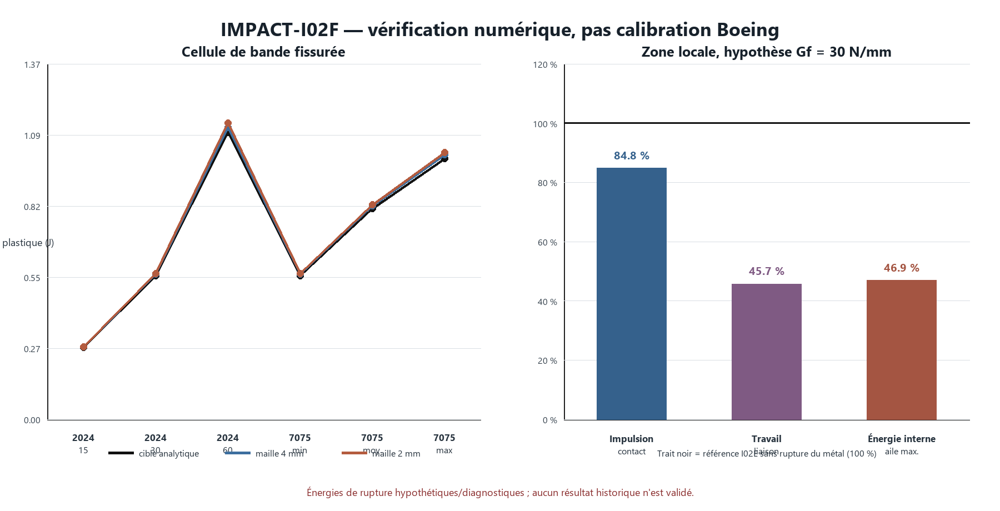

# WTC 1 — IMPACT-I02F : bande de déchirure et transfert local borné

## Résultat

Le portail numérique I02F est **PASS** : 15 cas de cellule, 281 contrôles de cas, 24 contrôles de campagne et 28 contrôles sur le transfert dans une seule zone I02E. La régularisation du **travail plastique prescrit** entre des mailles de 2 et 4 mm est vérifiée. Elle ne constitue pas une calibration physique de la déchirure du 2024-T3 ni une validation du Boeing 767.

Dans la zone locale, l'hypothèse centrale `Gf = 30 N/mm` provoque la première suppression de peau à **0.226031 ms**. **336/3072** coques de peau sont supprimées (10.938%, 95.668 g). L'impulsion de contact vaut **107.8992 N·s**, soit une variation de **-15.236%** par rapport au même cas I02E sans rupture du métal. Ce résultat est une sensibilité à la loi imposée, pas une conclusion sur l'événement réel.

## 1. Faits directement observés ou transcrits

- NASA CR-191523 étudie une tôle 2024-T3 de 2,3 mm : limite d'élasticité 360 MPa, résistance maximale 495 MPa, éprouvette M(T) de 76,2 × 300 mm avec fissure initiale totale de 25,4 mm. La déchirure stable passe d'un front tridimensionnel/tunnellisé à un régime oblique dont le CTOA de surface devient voisin de 6° après une extension d'environ une épaisseur (PDF pp. 3–16 et figure 1, p. 21).
- NASA/ARL-CR-198 publie pour des panneaux 2024-T3 un CTOA moyen de 5,15° ± 1° et emploie 5,4° dans STAGS avec un cœur de déformation plane et une maille minimale de 1 mm. Ces choix sont ajustés au modèle, pas directement transposables à `/FAIL/TAB1` (PDF pp. 4–5).
- NASA TN D-7262 rapporte, pour une tôle 7075-T6 de 2,3 mm, `E = 69,6 GPa`, `Rp = 523 MPa`, `Rm = 574 MPa` et 12 % d'allongement. Les douze `Kc` en air vont de 45,7 à 61,6 MPa√m (tableaux I et V, PDF pp. 20 et 26).
- La documentation officielle Radioss définit `/FAIL/TAB1` comme une table de déformation plastique à rupture pouvant dépendre notamment de la triaxialité ; le solveur 2026 avertit que cette carte est obsolète et recommande `/FAIL/TAB2`.

## 2. Résultats de modèles officiels ou publiés

- Les valeurs CTOA publiées décrivent la propagation de fissure dans des géométries et orientations précises. I02F ne reproduit ni la géométrie M(T), ni le front de fissure tridimensionnel, ni le modèle STAGS.
- L'équivalent 7075 `G = Kc²/E` donne **30,007 / 44,069 / 54,520 N/mm** (minimum / moyenne de `Kc²` / maximum). C'est une dérivation élastique diagnostique à partir de ténacités d'éprouvettes minces, pas une énergie de rupture ductile mesurée pour une structure d'aile.

## 3. Affirmations des archives locales

- Aucune nouvelle affirmation de l'archive locale n'est utilisée et l'archive source n'a pas été rescannée. Les quatre PDF d'entrée ont été copiés dans le dossier d'entrée I02F et traités en lecture seule ; l'un d'eux (`NASA_19740003601...`) est conservé mais non sélectionné car son contenu ne correspondait pas à la description du résultat de recherche.

## 4. Hypothèses propres au modèle

- La cellule active a une section de 8 × 2,3 mm ; sa longueur vaut la maille `h`. Le matériau est élastique-parfaitement plastique et toute la colonne d'éléments est une bande de localisation prescrite.
- La loi impose `eps_p,rupture = Gf / (sigma_y h)`. Le 2024-T3 est testé à 15, 30 et 60 N/mm ; cette plage est heuristique. La table de rupture est constante avec la triaxialité et ignore Lode, vitesse, température, direction de laminage et endommagement antérieur.
- Le transfert local conserve intégralement la carte I02E existante (`sigma_y = 310,264 MPa`) et son historique énergétique ; seule la rupture de la peau reçoit `Gf = 30 N/mm`, d'où `eps_p,rupture = 0.015227063` au maillage nominal 6,35 mm.
- Les éléments irréguliers de la zone utilisent la même longueur nominale 6,35 mm : ce transfert n'est donc pas régularisé élément par élément.

## 5. Résultats dérivés

- Erreur maximale entre travail plastique calculé et cible : **3.188%**.
- Écart maximal 4 mm ↔ 2 mm : force de plateau **0.636%**, travail plastique **1.392%**, travail total jusqu'à suppression **9.942%**.
- Sensibilité au demi-pas de temps : **0.00123%** au maximum.
- Zone locale : résidu énergétique maximal **4.856%** (portail 5 %), erreur impulsion-contact/moment de l'aile **0.474%**, erreur réaction/moment global **0.358%**.
- La liaison cohésive ne se supprime toujours pas ; c'est la peau métallique hypothétique qui change ici la réponse. Le travail de liaison diminue de **-54.287%** et le maximum d'énergie interne de l'aile de **-53.088%**.

## 6. Contradictions et informations manquantes

- Les sources donnent des CTOA, propriétés statiques et ténacités d'éprouvettes ; elles ne donnent pas une surface de rupture dynamique 2024-T3/7075-T6 complète pour les pièces réelles d'un 767.
- Une table constante de déformation à rupture ne représente ni l'initiation tridimensionnelle ni le tunneling observé. Le bon prochain test est une éprouvette M(T) entaillée, à deux maillages et orientations, avec propagation et CTOA mesuré.
- Le calcul local ne contient qu'une baie d'aile réduite de 1,98 kg et une colonne représentative, pas l'avion complet ni la façade complète. La baisse d'impulsion n'autorise aucune conclusion sur l'intégrité réelle des ailes, la pénétration historique ou une hypothèse de projection.
- Le bilan énergétique de zone passe de peu (4,856 % pour une limite de 5 %) ; il doit être resserré avec la rupture et la longueur caractéristique avant extension spatiale.
- Le contrôle froid V11F, les itérations I01–I02E et les sources originales restent inchangés.
