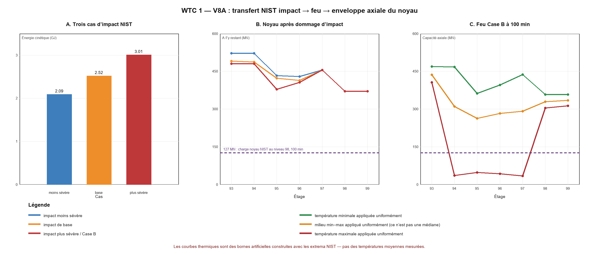

# WTC 1 — V8A : transfert impact–feu NIST sur les 47 colonnes du noyau

## Résultat principal

La chaîne de données est maintenant explicite : les trois impacts NIST donnent **2.09 GJ**, **2.52 GJ** et **3.01 GJ** d’énergie cinétique initiale. Le modèle final Case B ne reprend pas le cas de base : il reprend le cas d’impact **plus sévère**, puis traite comme absentes les colonnes qualifiées de sectionnées ou lourdement endommagées, étage par étage.

Cette opération ne suffit pas, à elle seule, à faire disparaître la capacité axiale brute du noyau. Au niveau 98, aucune des neuf colonnes Case B n’est supprimée et l’enveloppe nominale vaut encore **371 MN**. Même si la température maximale NIST de cet étage à 100 min (**227 °C**) était appliquée artificiellement aux 47 colonnes, l’enveloppe `A × Fy(T)` resterait **304 MN**, contre **127 MN** de charge totale du noyau donnée par le modèle global NIST au niveau 98.

Au niveau 95, les neuf colonnes sélectionnées par Case B sont toutes retirées : l’enveloppe brute descend à **379 MN**. L’application uniforme du milieu de la plage thermique NIST donnerait **263 MN**, tandis que l’application uniforme de son maximum donnerait seulement **48 MN**. Mais ces deux valeurs sont des constructions de sensibilité : NIST publie des extrema spatiaux, pas une température moyenne. On ne peut donc pas choisir la courbe rouge comme « résultat réel ».

La conclusion V8A est nette mais limitée : **les dommages d’impact NIST et leurs extrema thermiques peuvent produire localement des capacités axiales très faibles, mais les tableaux publiés ne suffisent pas à établir combien de colonnes se trouvent simultanément près de ces maxima ni quelle charge chacune porte**. L’initiation doit donc être testée par stabilité géométrique et redistribution noyau–planchers–façades, pas seulement par `A × Fy(T)`.

## Tableau de sensibilité Case B à 100 min

La ligne de comparaison de **127 MN** est la charge NIST du noyau au niveau 98. Sur les autres étages, elle sert uniquement d’échelle : ce n’est pas un champ de charges étage par étage.

| Étage | Colonnes retirées sur cet étage | A·Fy restant (MN) | plage T noyau (°C) | capacité à Tmin uniforme (MN) | capacité au milieu uniforme (MN) | capacité à Tmax uniforme (MN) | T uniforme pour atteindre 127 MN | fraction « chaude » min/max pour atteindre 127 MN |
|---:|---|---:|---:|---:|---:|---:|---:|---:|
| 93 | 504, 505, 506, 604, 704, 706, 805 | 481 | 28–193 | 469 | 436 | 406 | 688 °C | impossible même à Tmax uniforme |
| 94 | 504, 505, 506, 604, 704, 706, 805 | 481 | 31–904 | 468 | 310 | 36 | 688 °C | 79 % |
| 95 | 503, 504, 505, 506, 604, 704, 706, 805, 904 | 379 | 52–761 | 362 | 263 | 48 | 658 °C | 75 % |
| 96 | 503, 504, 505, 604, 704, 904 | 406 | 29–780 | 396 | 283 | 43 | 667 °C | 76 % |
| 97 | — | 455 | 45–901 | 437 | 291 | 34 | 682 °C | 77 % |
| 98 | — | 371 | 41–227 | 358 | 330 | 304 | 655 °C | impossible même à Tmax uniforme |
| 99 | — | 371 | 41–192 | 358 | 335 | 313 | 655 °C | impossible même à Tmax uniforme |

## Faits établis intégrés

- Conditions d’impact WTC 1 de base : 443 mph, 283 600 lb, 66 100 lb de carburant, trajectoire descendante de 10,6° et roulis de 25° aile gauche basse.
- Cas supplémentaires NIST : 414 mph / 95 % de la masse pour le cas moins sévère et 472 mph / 105 % de la masse pour le cas plus sévère, avec variations simultanées des déformations à rupture de l’avion et de la tour.
- Le cas structurel final B provient du dommage d’impact plus sévère et retire neuf identifiants de colonnes lorsqu’ils sont sectionnés ou lourdement endommagés.
- Les plages thermiques à 100 min proviennent des minima et maxima spatiaux des tableaux NIST pour les colonnes du noyau, les colonnes périphériques et les poutrelles de plancher.
- La réduction de limite d’élasticité suit l’équation 6-1 de NCSTAR 1-3D. Le module de Young transcrit suit l’équation 2-2 uniquement jusqu’à 600 °C.

## Hypothèses de V8A

- Les sections WF sont converties en aire brute à partir de leur poids nominal et d’une masse volumique de 490 lb/ft³; les trois caissons utilisent les dimensions de plaques déjà transcrites.
- Une colonne « heavy » est supprimée uniquement pour reproduire la règle conservatrice de transfert Case B; ce n’est pas une loi mécanique générale.
- Une suppression ne vaut que sur les étages indiqués par la carte NIST. Elle n’efface pas l’identifiant sur toute la hauteur de la tour.
- Les calculs « Tmin uniforme », « milieu uniforme » et « Tmax uniforme » sont des bornes de sensibilité. Le milieu min–max n’est ni une moyenne ni une médiane.
- La colonne « fraction chaude » mélange seulement deux températures et répartit la chaleur proportionnellement à la capacité nominale. Elle ne représente pas la carte spatiale NIST et ignore la concentration des charges.

## Archives locales : statut séparé

L’archive `Disaster and Failure Studies Repository` a été inspectée en lecture seule. Elle contient surtout des photographies et vidéos d’essais de feu, plus les visualisations officielles NIST des impacts, feux et réponses structurales. Aucun fichier tabulaire nouveau n’y a encore fourni de champ de température ou de charge directement exploitable. Les valeurs numériques V8A proviennent donc des rapports NIST primaires et des plans du WTC déjà transcrits; aucune affirmation éditoriale locale n’entre dans le calcul.

## Ce que V8A ne démontre pas

- `A × Fy(T)` ne décrit ni le flambement, ni la flexion thermique, ni le fluage, ni les imperfections initiales.
- Les façades, les planchers, leurs connexions et le hat truss ne sont pas encore couplés.
- L’impact n’est pas recalculé indépendamment : les trois cartes NIST sont les états initiaux testés.
- Aucune conclusion sur la propagation globale après l’amorce ne peut être tirée de cette seule enveloppe.

## Prochaine itération V8B

Construire le sous-modèle thermo-mécanique des niveaux 93–99 avec les 47 colonnes, des diaphragmes de plancher simplifiés et les retraits Case B localisés. Les cas thermiques seront au minimum : champ froid, champ médian explicitement synthétique, concentration chaude sur les colonnes de la trajectoire d’impact, et variantes d’isolant intact/retiré. Le critère sera une perte de stabilité sous charge imposée, pas seulement l’atteinte de la limite d’élasticité.

