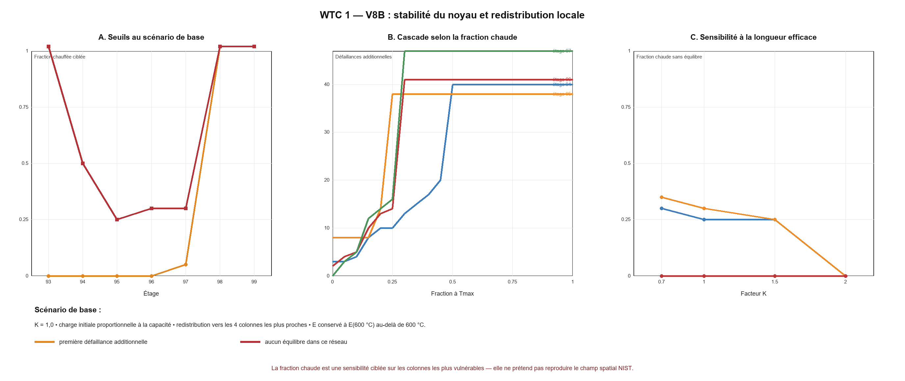

# WTC 1 — V8B : stabilité et redistribution du noyau

## Résultat principal

V8B remplace les inerties fictives par les propriétés historiques AISC des 43 profils WF, ajoute les trois caissons reconstruits, calcule une résistance nominale de colonne avec flambement, puis redistribue localement les charges lorsqu’une colonne est retirée ou dépasse sa capacité.

Dans le scénario de base (`K = 1,0`, charges initiales proportionnelles à la capacité nominale, redistribution vers quatre voisines, température maximale ciblée d’abord sur les colonnes les plus vulnérables), l’étage 95 connaît sa première défaillance additionnelle lorsque **0 %** des 38 colonnes restantes sont placées au maximum NIST de l’étage. Le réseau ne trouve plus d’équilibre à **25 %**. Au niveau 98, avec sa plage beaucoup plus basse de 41–227 °C, aucune perte d’équilibre n’apparaît même si les 47 colonnes sont placées au maximum publié (**> 100 %**).

Le seuil de première défaillance vaut 0 % aux niveaux endommagés parce que la seule redistribution des colonnes Case B surcharge déjà quelques voisines, même à la température minimale de l’étage. Aux niveaux 93–94, le réseau sélectionne d’abord **605, 705, 804**, puis retrouve un équilibre avec 37 colonnes. Ce résultat est qualitativement remarquable : NIST indique indépendamment que 705 a flambé après impact et que 605 et 804 ont montré un flambement mineur. Ces identifiants n’ont pas été imposés comme ruptures dans V8B. Au niveau 95, la même règle produit 8 défaillances supplémentaires à froid mais conserve encore un équilibre; cela illustre aussi la forte dépendance à la façon dont les planchers et le système global redistribuent réellement les charges.

Ce résultat resserre l’incertitude sans la supprimer : les niveaux 94–97 peuvent devenir instables dans le réseau si une fraction suffisante des colonnes porteuses approche les maxima thermiques, surtout après la suppression des éléments Case B et avec redistribution locale. Mais NIST ne publie pas, dans les tableaux utilisés ici, la fraction exacte de colonnes simultanément chaude ni un champ colonne-par-colonne directement réutilisable. V8B ne permet donc pas encore de dire que ce seuil a effectivement été atteint.

## Seuils à 100 min — scénario de base

| Étage | Colonnes Case B retirées | plage NIST noyau (°C) | première défaillance supplémentaire | plus d’équilibre | équilibre au milieu uniforme | équilibre à Tmax uniforme |
|---:|---|---:|---:|---:|---:|---:|
| 93 | 504, 505, 506, 604, 704, 706, 805 | 28–193 | 0 % | > 100 % | oui | oui |
| 94 | 504, 505, 506, 604, 704, 706, 805 | 31–904 | 0 % | 50 % | oui | non |
| 95 | 503, 504, 505, 506, 604, 704, 706, 805, 904 | 52–761 | 0 % | 25 % | non | non |
| 96 | 503, 504, 505, 604, 704, 904 | 29–780 | 0 % | 30 % | oui | non |
| 97 | — | 45–901 | 5 % | 30 % | oui | non |
| 98 | — | 41–227 | > 100 % | > 100 % | oui | oui |
| 99 | — | 41–192 | > 100 % | > 100 % | oui | oui |

## Faits établis intégrés

- NIST signale que son noyau isolé WTC 1 avec dommage Case B ne convergeait pas sous gravité sans redistribution vers le système global; c’est précisément la raison d’introduire ici deux règles de redistribution.
- Le noyau NIST complet incluait les colonnes, poutres et dalles des niveaux 89–106, la plasticité, le flambement plastique et le fluage; il n’incluait pas le hat truss dans le sous-modèle isolé.
- Au niveau 98, la charge totale du noyau Case B passe de 34 429 kip après impact à un maximum de 36 473 kip à 10 min, puis à 28 478 kip à 100 min.
- NIST indique que les colonnes 501, 508, 703, 803, 904, 1002, 1006 et 1007 étaient renforcées entre les niveaux 98 et 106.
- La base AISC historique téléchargée fournit `A`, `Ix`, `Iy`, `rx` et `ry`; NIST dit avoir utilisé le manuel AISC 6e édition, sauf les 14WF455–730 pris dans LRFD3.

## Hypothèses de V8B

- Les charges individuelles sont testées suivant trois répartitions : proportionnelles à la capacité, proportionnelles à l’aire, ou issues d’aires tributaires de plan calculées autour des coordonnées du noyau.
- Après une rupture, la charge est soit redistribuée globalement, soit envoyée vers les quatre colonnes intactes les plus proches.
- Le facteur de longueur efficace `K` est balayé de 0,7 à 2,0. `K = 1,0` sert de scénario de base; `K = 2,0` représente une perte forte de maintien latéral.
- Les colonnes « severed » et « heavy » sont retirées étage par étage; les états « moderate » et « light » restent intacts faute de loi de réduction publiée.
- La capacité utilise la courbe nominale de colonne `Fcr` avec `Fy(T)` NIST. Au-dessus de 600 °C, deux prolongements explicites de `E(T)` sont testés parce que le polynôme transcrit n’est valide que jusqu’à 600 °C.
- Le cas « fraction chaude ciblée » place `Tmax` sur les membres présentant le rapport charge/capacité le plus défavorable et `Tmin` sur les autres. C’est une borne organisée, pas une reconstruction du feu.

## Zones d’incertitude et contradictions apparentes

- **Pas une contradiction formelle :** NIST lui-même rapporte que le noyau isolé Case B ne trouvait pas d’équilibre initial, alors que son modèle global le pouvait grâce aux autres chemins de charge. Notre réseau retrouve que la règle de redistribution change fortement le seuil.
- **Donnée manquante majeure :** les charges exactes colonne par colonne et les températures correspondantes ne sont disponibles ici que sous forme de figures à bulles et d’extrema. Les trois répartitions reconstruites restent des hypothèses.
- **Renforts manquants :** les dimensions des plaques de renforcement des huit colonnes 98–106 n’ont pas été retrouvées. V8B les omet, ce qui sous-estime leur résistance et rend les résultats 98–99 conservateurs.
- **Propriétés historiques :** la base AISC v16.0H ne présente pas de ligne « 6th » dans sa table principale pour ces profils. Les lignes ASD7 sont donc marquées comme proxy historique, tandis que 14WF500 et 14WF550 utilisent LRFD3 conformément à la règle NIST.
- **Limite essentielle :** un réseau d’un étage ne reproduit ni le raccourcissement cumulatif du noyau, ni le hat truss, ni la flexion thermique, ni le fluage, ni l’attraction de charge par dilatation, ni la traction exercée par les planchers sur la façade sud.

## Étape V8C

La prochaine version doit être un sous-modèle 3D des niveaux 93–99 dans CalculiX : poutres-colonnes avec imperfections, diaphragmes de plancher simplifiés, retraits Case B localisés et histoires thermiques par groupes spatiaux. Les résultats V8B servent à choisir les cas qui méritent ce calcul coûteux : `K ≈ 1`, redistribution locale, étages 94–97, fractions chaudes autour des seuils trouvés, plus variantes froides et maximales.

